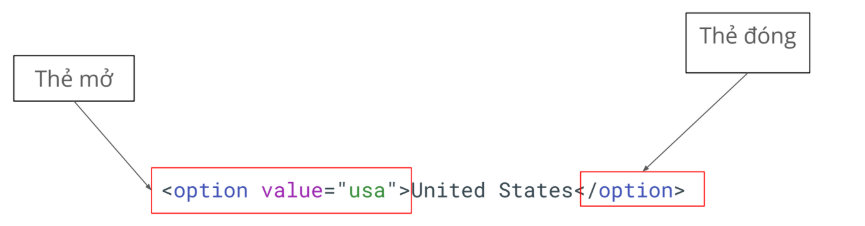
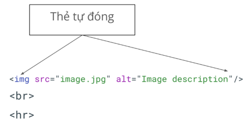
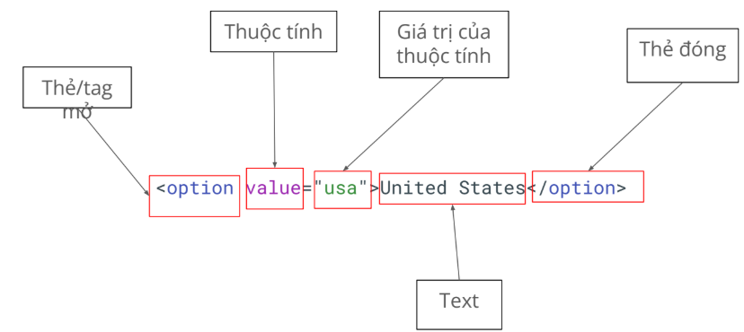
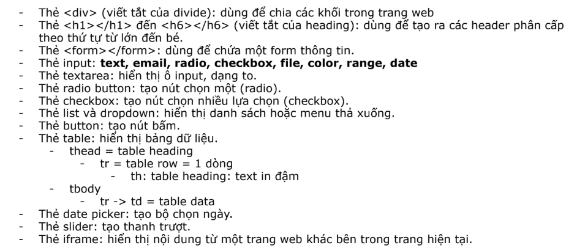

# LESSON-5-SUMMARY:
1. Lambda function (arrow function)
2. Anynomous function
3. DOM
4. Selector
5. Playwright basic synctax

## 1. LAMBDA FUNCTION (ARROW FUNCTION)
### CÚ PHÁP:
(paramater) => {  
    //code here  
};

### Cách dùng và sample:
#### GÁN ARROW FUNCTION VỚI MỘT BIẾN, ĐỂ GỌI HÀM KHI SỬ DỤNG
const tenHam1 = (param 1, param2) => {  
    //code here ; 
};  
tenHam1("param1", "param2"); //cách dùng: gọi hàm và truyền param vào  

#### HÀM KHÔNG CÓ PARAM:  
const tenHam2 = () => {  
    //code here;  
};  
tenHam2();

#### HÀM CÓ MỘT PARAM:
const tenHam3 = x => {  
    //code here;
};
tenHam3(x);

#### HÀM CÓ MỘT DÒNG LỆNH:
const tenHam4 = x => x * 2;  
tenHam4(x);

const temHam5 = (a, b) => a + b;  
//không cần return ở đây, trường hợp chỉ có 1 dòng lệnh

const arrs = [1, 2, 3, 4];  
arrs.map(arr => arr * 2); //no need return

## 2. ANYNOMOUS FUNCTION
- Hàm không tên
- Do không có tên nên chức năng chính :  
    + sử dụng 1 lần ngay thời điểm khai báo
    + sử dụng làm đối số cho một hàm khác

#### standard function:
function `<nameFunction>`() {  
    // code;
};
#### anynomous function:
*sử dụng một lần:*  
(function () {  
    //console.log("Đây là hàm không tên");  
})();  
// cách dùng anynomous function là ngoặc tròn cả function, và thêm một ngoặc tròn. Được hiểu là thực thi luôn mà không cần gọi lại hàm  

*sử dụng làm đối số*  
setTimeout(function () {  
    //console.log("Đây là hàm không tên");  
}, 3000);

## 3. DOM
- Document Object Model
- Cấu trúc của html hay tài liệu về các đối tượng trong một trang web, mô tả về tất cả phần tử trên trang web
- Giúp mình mô hình hóa trang web, hiểu trang web được xây dựng như thế nào
- Từ đó có thể truy xuất, tương tác với các document có dạng html

### Cấu trúc của một thẻ html:
- một thẻ gọi là một node
- cấu trúc thường thấy: thẻ mở, thẻ đóng và đoạn text giữa chứa nội dung thẻ  

### Thẻ tự đóng
- dùng cho các phần tử không chức nội dung  
` ` : thẻ xuống dòng  
`
` : thẻ để kẻ đường ngang  

### Thuộc tính  

### Thẻ thường gặp  

## 4. SELECTOR:
- là cách chọn phần tử trên trang
- có nhiều kiểu:
    + XPath selector
    + CSS selector  
    + Playwright selector

###  XPATH SELECTOR:  
- thường dùng XPath tương đối:
    + bắt đầu bởi 2 //  
    + //tenthe[@thuoctinh=”giatri”]  
- VD:
    + //input[@id="email"]
- phải đảm bảo selector mà mình chọn là unique, duy nhất

## 5. PLAYWRIGHT BASIC SYNCTAX:  
### Test:  
- đơn vị cơ bản để khai báo một test case/ test scenerio